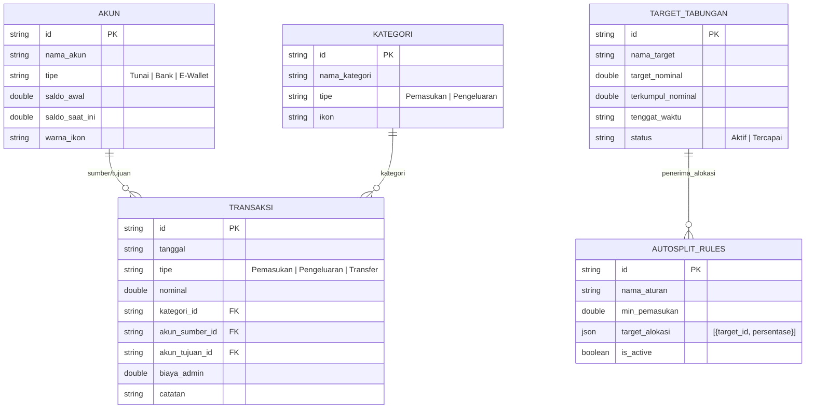
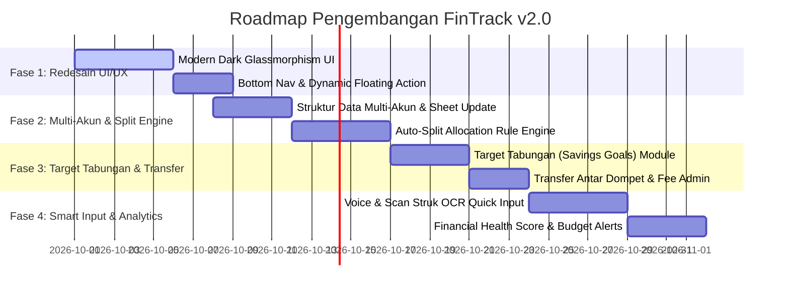

# 🚀 Master Plan & Rencana Pembaharuan FinTrack (FinTrack v2.0)
> **Berbasis Hasil Benchmark & Reverse Engineering Aplikasi Saldoin**  
> **Tanggal Penyusunan**: 28 September 2026  
> **Status**: Ready for Implementation  

---

## 📑 Daftar Isi
1. [Ringkasan Eksekutif & Hasil Analisis Saldoin](#1-ringkasan-eksekutif--hasil-analisis-saldoin)
2. [Matriks Analisis Kesenjangan (Gap Analysis)](#2-matriks-analisis-kesenjangan-gap-analysis)
3. [Arsitektur Sistem & Database FinTrack v2.0](#3-arsitektur-sistem--database-fintrack-v20)
4. [Rencana Pembaharuan Berbertahap (Roadmap 4 Fase)](#4-rencana-pembaharuan-berbertahap-roadmap-4-fase)
5. [Spesifikasi Fitur Unggulan (Killer Features)](#5-spesifikasi-fitur-unggulan-killer-features)
6. [Langkah Eksekusi Selanjutnya](#6-langkah-eksekusi-selanjutnya)

---

## 1. 🔍 Ringkasan Eksekutif & Hasil Analisis Saldoin

Berdasarkan analisis mendalam terhadap **Saldoin** (`com.selo.rvsd`) melalui 138 screenshot ADB & rekaman alur pengguna, Saldoin memiliki **4 Keunggulan Utama**:

1. **Auto-Split Tabungan Otomatis (Killer Feature)**:
   * Pengguna membuat aturan alokasi (misal: "Alokasi Gaji Bulanan").
   * Setiap ada pemasukan $\ge X$, sistem otomatis memotong saldo sesuai porsi persentase (%) dan mendistribusikannya langsung ke berbagai Target Tabungan / Dompet.
2. **Manajemen Multi-Akun & Transfer Transparan**:
   * Memisahkan uang kas, rekening bank, dan e-wallet.
   * Pencatatan biaya admin transaksi transfer antar bank/dompet secara terpisah dan akurat.
3. **Savings Goals (Target Tabungan)**:
   * Visualisasi progress persentase, countdown sisa hari, dan tab riwayat setoran.
4. **Multi-Channel Fast Entry**:
   * Pintu masuk transaksi cepat via WA Bot (Teks NLP, Foto Struk OCR, dan Voice Note Speech-to-Text).

---

## 2. 📊 Matriks Analisis Kesenjangan (Gap Analysis)

| Dimensi Fitur | FinTrack (Saat Ini) | Saldoin (Benchmark) | FinTrack v2.0 (Target Upgrade) |
| :--- | :--- | :--- | :--- |
| **Desain Antarmuka** | Single Page Mobile Container dasar | Pastel Soft Light Mode modern | **Dark Glassmorphism Premium** dengan aksen Neon Emerald & Micro-animations |
| **Multi-Akun (Wallet)** | Gabung (1 Saldo Utama) | Terpisah (Cash, Bank, E-Wallet) | **Multi-Akun Dinamis** (Kas, BCA, BRI, GoPay, OVO, DANA) + Icon & Color Badge |
| **Alokasi Pemasukan** | Manual per transaksi | **Auto-Split Rules Engine** | **Engine Alokasi Otomatis** (Aturan Persentase Porsi dari Pemasukan Bulan Berjalan) |
| **Target Tabungan** | Catat manual sederhana | Progress bar + Countdown Hari | **Interactive Goal Cards** + Milestone Progress + Auto-Deposit dari Pemasukan |
| **Transfer Antar Dompet** | Belum ada | Formulir Transfer + Fee Admin | **Modul Transfer Antar Akun** + Biaya Admin Otomatis |
| **Input Cepat AI** | Manual form | WA Bot (OCR, Voice, Text NLP) | **Web Voice Input (Web Speech API)** + Scan Struk OCR & Bot Connector |
| **Analisis Keuangan** | Chart Donut Kategori | Pie Chart + Trend Pemasukan/Pengeluaran | **Financial Health Score**, Smart Budget Alerts & Visual Cashflow Heatmap |

---

## 3. 🏗️ Arsitektur Sistem & Database FinTrack v2.0

Untuk mendukung fitur-fitur baru seperti **Multi-Akun**, **Target Tabungan**, dan **Auto-Split Rules**, struktur data di Google Sheets (`Code.gs`) dan LocalStorage (`app.js`) diperluas menjadi 6 entitas utama:



---

## 4. 🚀 Rencana Pembaharuan Berbertahap (Roadmap 4 Fase)



### 🔹 **Fase 1: Redesain UI/UX & Navigasi Utama Modern**
- **Tampilan Dark Glassmorphism**: Mengadopsi palet warna gelap elegan (`#0F172A`, `#1E293B`) dipadukan dengan aksen gradien neon emerald/mint (`#10B981` ke `#059669`).
- **Navigasi Bawah 4 Tab**:
  1. 🏠 **Dashboard**: Ringkasan Total Saldo, Quick Action Buttons, & Transaksi Terakhir.
  2. 💳 **Akun & Target**: Manajemen Dompet & Target Tabungan.
  3. 📊 **Analisis**: Diagram Donut, Heatmap, & Financial Score.
  4. ⚙️ **Pengaturan**: Pengaturan API GAS, Pengingat Jam Catat, & Master Kategori.
- **Quick Action Bar (FAB)**: Button aksi cepat melayang di tengah navigasi untuk `+ Catat`, `🔄 Transfer`, `🔀 Auto-Split`, `🎙️ Suara`.

---

### 🔹 **Fase 2: Engine Multi-Akun & Auto-Split Tabungan Otomatis**
- **Manajemen Multi-Akun**:
  - Pengguna dapat menambah dompet: Kas Tunai, Bank BCA/BRI/Mandiri, E-Wallet GoPay/OVO/DANA.
  - Setiap transaksi pengeluaran/pemasukan memotong/menambah saldo akun tertentu secara real-time.
- **Auto-Split Rules Engine (Killer Feature)**:
  - Fitur membuat aturan alokasi otomatis saat pengguna mencatat **Pemasukan**.
  - *Contoh*: Jika input Pemasukan Rp 5.000.000 (Gaji), Aturan "Alokasi Gaji" otomatis membagi:
    - 50% (Rp 2.500.000) $\rightarrow$ Uang Operasional (Akun Utama)
    - 30% (Rp 1.500.000) $\rightarrow$ Target Tabungan "Dana Darurat"
    - 20% (Rp 1.000.000) $\rightarrow$ Target Tabungan "Investasi / Gadget"

---

### 🔹 **Fase 3: Target Tabungan (Savings Goals) & Transfer Antar Akun**
- **Modul Target Tabungan ("Nabung")**:
  - Kartu visual progresif dengan indikator persentase (0-100%).
  - Estimasi sisa hari hingga target tercapai berdasarkan rata-rata setoran bulanan.
  - Tab **Riwayat Setoran** untuk melacak setiap rupiah yang dialokasikan.
- **Transfer Antar Dompet**:
  - Opsi memindahkan dana dari Dompet A (misal: Rekening Bank) ke Dompet B (misal: GoPay / Target Tabungan).
  - Mendukung pencatatan **Biaya Admin** (misal: Rp 2.500 / Rp 6.500) yang dicatat otomatis sebagai pengeluaran non-kategori.

---

### 🔹 **Fase 4: Smart Quick Input (Voice & OCR) & Smart Analytics**
- **Voice-to-Transaction Input**:
  - Menggunakan browser Web Speech API: Pengguna menekan tombol mikrofon dan mengucapkan `"Beli bensin lima puluh ribu dari Gopay"`.
  - Smart Parser otomatis mengisi formulir nominal (`50000`), kategori (`Transportasi`), dan akun (`GoPay`).
- **Financial Health Score**:
  - Algoritma penilaian kesehatan finansial (Rasio Tabungan, Rasio Pengeluaran vs Pemasukan, & Sisa Anggaran).
- **Notifikasi Pengingat Catat Harian**:
  - Fitur PWA Push Notification / Local Reminder pada jam yang ditentukan (misal 21:00 WIB).

---

## 5. 🛠️ Rincian Perubahan Kode & Backend

### 1. Perubahan Backend (`Code.gs`)
- Penambahan nama Sheet di Spreadsheet: `Transactions`, `Accounts`, `Goals`, `Rules`, `Categories`.
- Penanganan tindakan API baru:
  - `action = "getDashboardData"`: Mengambil saldo gabungan, daftar akun, target aktif, & 5 transaksi terakhir sekaligus.
  - `action = "addTransactionWithAutoSplit"`: Menyimpan transaksi pemasukan dan mengeksekusi aturan pemotongan otomatis.
  - `action = "transferBetweenAccounts"`: Mengurangi akun asal, menambah akun tujuan, dan mencatat biaya admin.

### 2. Perubahan Frontend (`app.js` & `index.html`)
- Mengganti state monolithic dengan state modular:
  ```javascript
  const state = {
      accounts: [],
      transactions: [],
      goals: [],
      rules: [],
      categories: [],
      currentMonth: new Date().toISOString().slice(0, 7)
  };
  ```
- Komponen Modals baru: Modal Auto-Split Rule Editor, Modal Transfer, Modal Target Tabungan.

---

## 6. 🏁 Penutup & Rekomendasi Eksekusi

Dengan mengimplementasikan **Master Plan FinTrack v2.0** ini:
1. **FinTrack** tidak hanya menyamai kapabilitas Saldoin, tetapi **melampauinya** dari segi performa (SPA PWA ultra-cepat), estetika visual (Dark Glassmorphism Premium), serta fleksibilitas (Web Voice Input & Sinkronisasi Google Sheets gratis tanpa berlangganan).
2. Pengembangan dapat langsung dimulai dari **Fase 1 (Redesain Navigasi & UI)** dan **Fase 2 (Multi-Akun & Auto-Split Rules)**.
